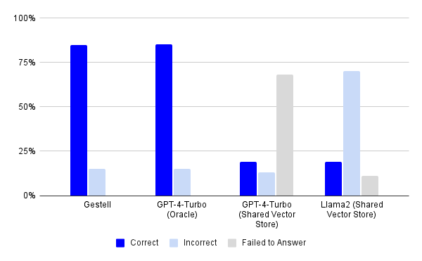

# Gestell Finance Bench Evaluation

To learn more, view the [article by Gestell](https://gestell.ai/blog/finance-bench) about the Finance Bench evaluation.

We have also provided an extensive [factsheet](./factsheet.csv) going over incorrect answers.

As of now, Gestell performs at about ~85% (with a >50,000 page collection using retrieval) which is about the same as GPT4 being fed the relevant page #s in context.



If you just want to review the responses from Gestell's LM, see the [responses folder](./responses). You will notice the main bottleneck on evaluation are calculations (Patronus itself has some incorrect calculations, see [this](https://github.com/patronus-ai/financebench/issues/7)). However, there will be a couple reasoning issues that occur for retrieval with the agent (retrieves incorrect page numbers). For your own application, in most cases, reformatting your prompt will resolve the failures you see in the evaluated responses.

## Workflow

Add your keys for both Patronus and Gestell in a `.env` file:

```env
GESTELL_API_KEY="..."

PATRONUS_API_KEY="..."
PATRONUS_EXPERIMENT_ID="..."
PATRONUS_EVAL="true"
```

Run the setup script:

```bash
bun run src/setup.ts
```

The setup script creates a new organization, collection and then adds all source documents to the Collection.

Note that it may take a few hours to process all the PDFs from Finance Bench.

You can check the status by going to the Web UI or running:

```bash
bun run src/status.ts
```

Once complete, you can now run the evaluation:

```bash
bun run src/eval.ts
# or with pm2
pm2 start --interpreter bun src/eval.ts --name gestell-financebench --no-autorestart
pm2 log gestell-financebench --raw
```

If you want to just view outputs, set `PATRONUS_EVAL` to false:

```env
PATRONUS_EVAL="false"
```

Elsewise, responses will only be stored in the `responses` folder in both markdown and json.
